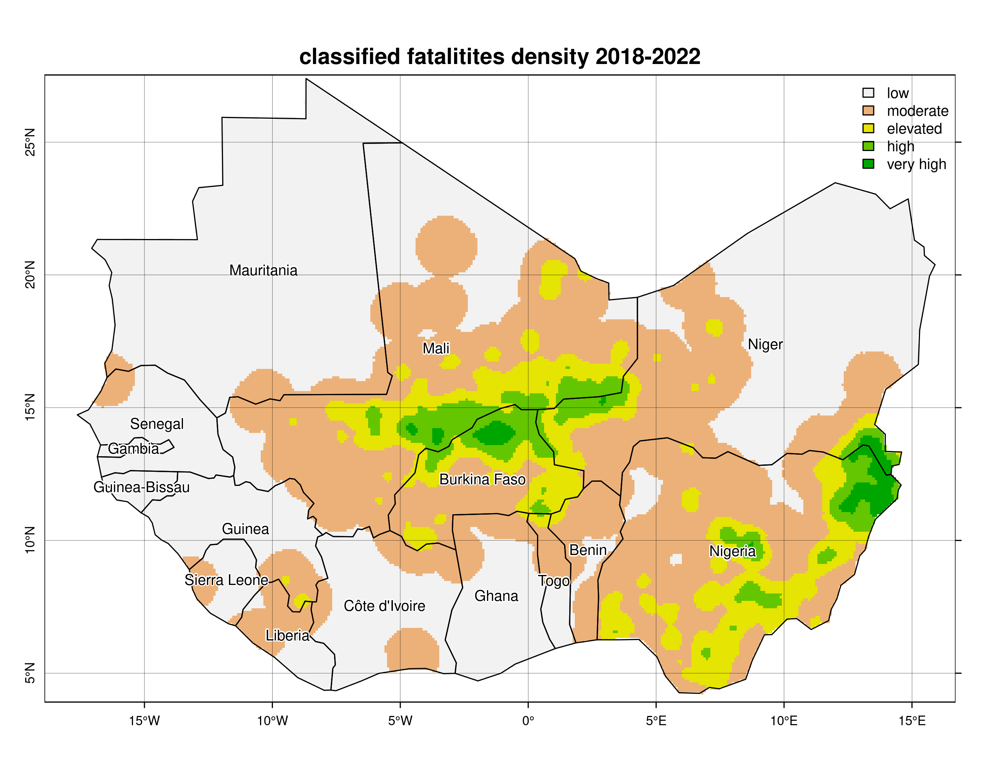

# Conflict density analysis in Western Africa 2018 - 2022

Based on the [UCDP GED](https://ucdp.uu.se/encyclopedia) data base on
violent conflict events, the density of both the occurrence of conflicts
and associated fatalities are estimated in Western African countries for
the years 2018 to 2022. KfW project locations (the data is not shared
due to privacy constraints) are then overlaid with the densities to
analyse the exposure to conflict of projects in the area.

## Inputs

-   UCDP GED v23.1 (vector)
-   Project locations (vector, not included)

## Outputs

-   empirical density estimation of conflict occurrences (raster)
-   empirical density estimation of fatalities (raster)
-   classified estimation of conflict density (raster)
-   classified estimation of fatalities density (raster)
-   filtered version of UCDP GED data base in the area (vector)
-   project locations with extracted values of the density estimations
    (vector, not included)

## Method

The UCDP GED data base is filtered to only include events that lie
within Western African countries for the time period from 2018 to 2022.
Points with a location accuracy worse than level 3 (indicating an
accuracy at the level of sub-national administrative districts) are
excluded. Events occurring at the same location are combined on a yearly
basis, i.e. treated as a single event at that location or the sum of
causalities over that year. These points are then treated as a point
pattern and the empirical density of the number of conflicts and the
number of total fatalities area calculated based on a 10 by 10 km
spatial grid using a Gaussian kernel with a bandwidth of 25 kilometers.
Pixel values represent intensity values, i.e. the observed count of
conflicts / number of fatalities within the estimation kernel centered
at the respective pixel in relation to the pixel size. Based on a
subjective classification scheme, areas of varying conflict intensities
are mapped and overlayed with project locations. For reasons of
confidentiality, project locations are not included here.

## Licence

CC BY-SA 4.0 Find a copy of the licence
[here](https://creativecommons.org/licenses/by-sa/4.0/legalcode.en)
